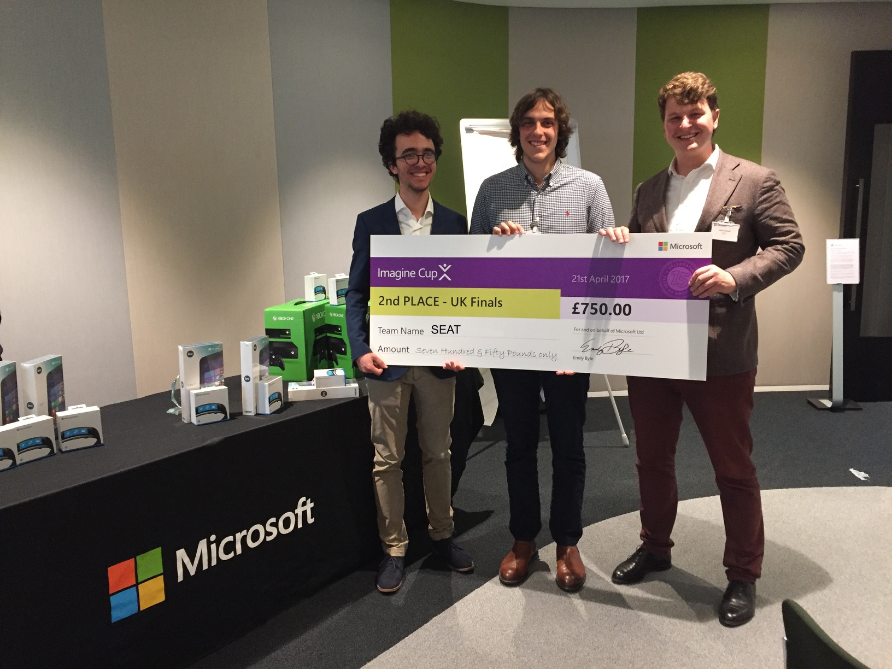

# Microsoft Imagine Cup 2017
#### Saturday, 28th May 2017
After having a first working proof of concept, which we showed to [Geoff Hughes](https://www.linkedin.com/in/geoffhu/) and [Lee Stott](https://www.linkedin.com/in/leestott/) from Microsoft a first demo, who then motivated us to apply for Imagine Cup. We decided to follow their advice as we wanted to showcase our project to more people and get their opinion and feedback.
Mid April 2017 we learnt that we qualified for the UK National Finals in London on the 21st and where excited to attend the event hosted in Microsofts Office in Paddington London. The day was an amazing opportunity to meet new interesting people, talk to people from industry and present our work to judges, in order to find out if the idea is worth further work. Before the event Microsoft gave us two mentors helping us with the presentation and the preparation of the pitch, in order to ensure cover everything the judges are looking for. Furthermore, on the day of the finals, we had additional time with our mentors who gave us last minute advise, which was extremely helpful.
After pitching our idea to the judges and answering their questions we heard a talk about Microsoft's support for start-up and from a team, which won the world final of Imagine Cup a couple years ago. Afterwards, the winners were finally announced: We came 2nd!! Amazing! We still cannot believe it! And even better, this year, it isn't just the first place, which will compete in the world finals, but the top three... we are going to SEATTLE! 

We couldn't be happier with this result and are currently working hard to implement new features for the world finals! So stay tuned!

# What is SEAT?
#### Friday, 27th May 2017
During our first year at UCL we were introduced to the Haskell programming language, which was taught via lectures and lab sessions where teaching assistants helped us with programming assignments given by our professor. We could rely on the TAs to answer specific questions if we were struggling,  however they weren’t able to spend a lot of time going through the code and checking if it was correct. The only way we had to verify that our solutions were correct was to compare our code with the model answers once they were released the following week, or ask teaching assistants, who just had a limited time. We thought that this system could be improved to both make students’ lives easier when learning programming and also increase professors’ productivity. 
 
Our vision as students was to be able to read, code, and test the solution inside a real IDE which professional programmers use later in their career. Likewise, there should be an easy way for teachers to write assignments. And wouldn’t it also be great to give real-time feedback to the professor, so she/he sees where students are struggling and being able to adjust the curriculum?
At this point, we realized we will need two things:
1. An IDE running on the major OS and which is easy to extend
2. A cloud infrastructure for easy data collection

The solution to the first problem was to create a [Visual Studio Code extension](https://marketplace.visualstudio.com/items?itemName=UCL.labassignments) that would allow students to read and code their assignments solutions without having to leave the IDE. Moreover, it would enable them to check if their code was correct at the click of a button.


For the latter, we decided to build cloud based infrastructure with Azure. Professors can easily create new assignments in a markdown file, upload it to the dashboard and distribute the encrypted file among his/her students. 

Markdown file for a Haskell Assignment:
````
# Exercise 1 
Implement these functions recursively.
## Question 1 - Length Function
Implement the `length` function, which 
returns the length of any arbitrary list.
```
length :: [a] -> Int
length [] = 0
length (x:xs) = 1 + length xs
```
````

SEAT will collect statistics from its users enabling professors to get feedback on their students' performance, which allows them to adjust their teaching methods.


# Hello World!
#### Thursday, 26th May 2017
```haskell
main :: IO ()
main = do putStrLn "Hello World!"
          putStrLn "Welcome to our blog!"
          putStrLn "We are..."
```
... three computer science undergraduate students at [University College London](www.ucl.ac.uk) and have built a proof of concept of a new tool, which enhances the expierence of programming assignments for students and professors.
Currently our team is 
1. [Janós Potecki](https://www.linkedin.com/in/janospotecki/) from Germany
2. [Martí Serra Vivancos](https://www.linkedin.com/in/martiserravivancos/) from ~~Spain~~ Catalonia
3. [Marco Concetto Rudilosso](https://www.linkedin.com/in/marco-concetto-rudilosso-048614108/) from Italy
