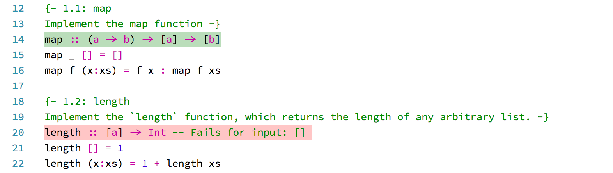
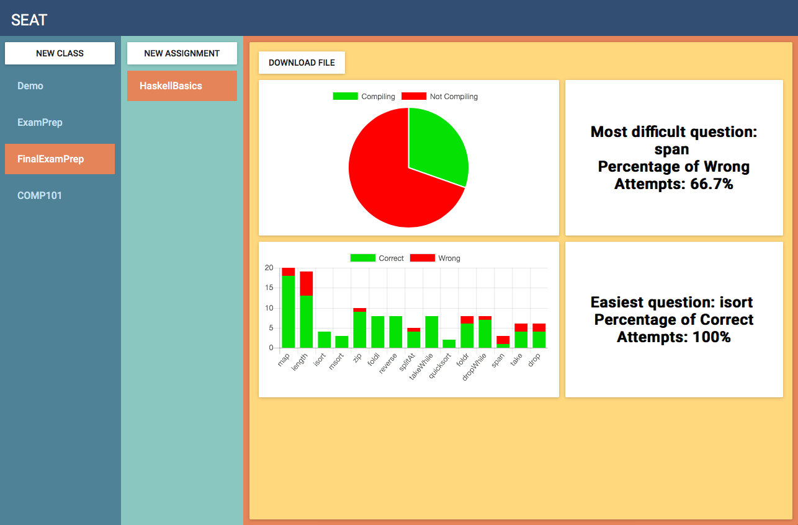

# What is SEAT?
#### Friday, 27th May 2017
During our first year at UCL we were introduced to the Haskell programming language, which was taught via lectures and lab sessions where teaching assistants helped us with programming assignments given by our professor. We could rely on the TAs to answer specific questions if we were struggling,  however they weren’t able to spend a lot of time going through the code and checking if it was correct. The only way we had to verify that our solutions were correct was to compare our code with the model answers once they were released the following week, or ask teaching assistants, who just had a limited time. We thought that this system could be improved to both make students’ lives easier when learning programming and also increase professors’ productivity. 
 
Our vision as students was to be able to read, code, and test the solution inside a real IDE which professional programmers use later in their career. Likewise, there should be an easy way for teachers to write assignments. And wouldn’t it also be great to give real-time feedback to the professor, so she/he sees where students are struggling and being able to adjust the curriculum?
At this point, we realized we will need two things:
1. An IDE running on the major OS and which is easy to extend
2. A cloud infrastructure for easy data collection

The solution to the first problem was to create a [Visual Studio Code extension](https://marketplace.visualstudio.com/items?itemName=UCL.labassignments) that would allow students to read and code their assignments solutions without having to leave the IDE. Moreover, it would enable them to check if their code was correct at the click of a button.


For the latter, we decided to build cloud based infrastructure with Azure. Professors can easily create new assignments in a markdown file, upload it to the dashboard and distribute the encrypted file among his/her students. 

Markdown file for a Haskell Assignment:
````
# Exercise 1 
Implement these functions recursively.
## Question 1 - Length Function
Implement the `length` function, which 
returns the length of any arbitrary list.
```
length :: [a] -> Int
length [] = 0
length (x:xs) = 1 + length xs
```
````

SEAT will collect statistics from its users enabling professors to get feedback on their students' performance, which allows them to adjust their teaching methods.


# Hello World!
#### Thursday 26th May 2017
```haskell
main :: IO ()
main = do putStrLn "Hello World!"
          putStrLn "Welcome to our blog!"
          putStrLn "We are..."
```
... three computer science undergraduate students at [University College London](www.ucl.ac.uk) and have built a proof of concept of a new tool, which enhances the expierence of programming assignments for students and professors.
Currently our team is 
1. [Janós Potecki](https://www.linkedin.com/in/janospotecki/) from Germany
2. [Marco Concetto Rudilosso](https://www.linkedin.com/in/martiserravivancos/) from Italy
3. [Martí Serra Vivancos from](https://www.linkedin.com/in/marco-concetto-rudilosso-048614108/) ~~Spain~~ Catalonia